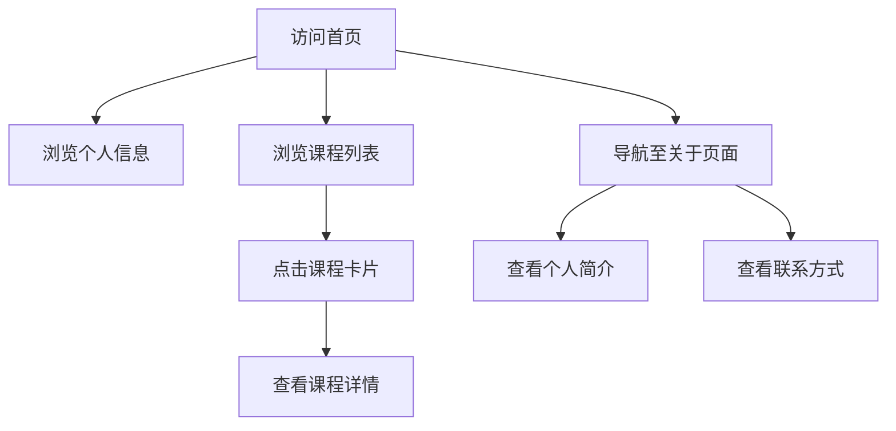

## 1. Product Overview
个人页面展示平台，用于广东科学技术职业学院商务数据分析专业学生魏冉展示课程信息
- 主要功能包括个人信息展示和多门课程信息管理，方便后续补充课程内容
- 目标用户为魏冉本人及潜在的招聘方或教育机构，展示专业能力和学习成果

## 2. Core Features

### 2.1 User Roles
| Role | Registration Method | Core Permissions |
|------|---------------------|------------------|
| 魏冉 | 无（个人页面） | 管理课程内容 |
| 访问者 | 无 | 浏览页面内容 |

### 2.2 Feature Module
1. **首页**：个人信息展示、课程列表、导航菜单
2. **课程详情页**：课程详细信息、学习内容、成果展示
3. **关于页面**：个人简介、专业背景、联系方式

### 2.3 Page Details
| Page Name | Module Name | Feature description |
|-----------|-------------|---------------------|
| 首页 | 个人信息展示 | 展示魏冉的姓名、专业、学校等基本信息 |
| 首页 | 课程列表 | 以卡片形式展示所有课程，点击进入详情页 |
| 课程详情页 | 课程信息 | 展示课程名称、描述、学习内容等详细信息 |
| 课程详情页 | 内容补充 | 预留接口，方便后续添加课程具体内容 |
| 关于页面 | 个人简介 | 详细介绍魏冉的学习经历、技能特长等 |
| 关于页面 | 联系方式 | 提供联系方式，方便他人联系 |

## 3. Core Process
用户访问首页 → 浏览个人信息和课程列表 → 点击课程卡片进入详情页 → 查看课程详细信息 → 导航至关于页面了解更多个人信息

## 4. User Interface Design
### 4.1 Design Style
- 主色调：蓝色系（#3b82f6）和白色（#ffffff），体现专业、清新的风格
- 辅助色：浅灰色（#f3f4f6）用于背景，深灰色（#374151）用于文本
- 按钮风格：圆角矩形，带有轻微的阴影效果
- 字体：无衬线字体，主标题使用较大字号，内容使用适中字号
- 布局风格：卡片式布局，清晰的信息层次，响应式设计
- 图标风格：简约线条图标，与整体风格一致

### 4.2 Page Design Overview
| Page Name | Module Name | UI Elements |
|-----------|-------------|-------------|
| 首页 | 个人信息展示 | 顶部横幅，包含姓名、专业、学校信息，使用较大字体和主色调 |
| 首页 | 课程列表 | 网格布局的课程卡片，每张卡片包含课程名称和简短描述，悬停时有轻微动画效果 |
| 课程详情页 | 课程信息 | 顶部课程名称，下方内容区域，使用卡片式布局展示详细信息 |
| 关于页面 | 个人简介 | 左侧个人照片，右侧详细文字介绍，使用清晰的排版 |
| 关于页面 | 联系方式 | 图标+文字形式展示联系方式，布局整洁 |

### 4.3 Responsiveness
- 设计采用桌面优先原则，同时适配平板和移动设备
- 在移动设备上，课程卡片将从网格布局变为单列布局
- 导航菜单在移动设备上变为汉堡菜单
- 确保所有内容在不同屏幕尺寸下都能正常显示和交互

### 4.4 3D Scene Guidance
- 不适用，本项目为平面页面设计