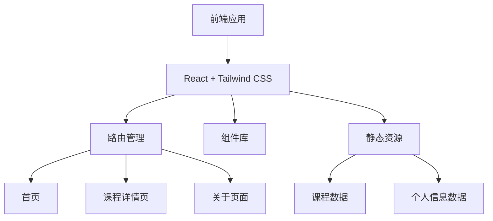
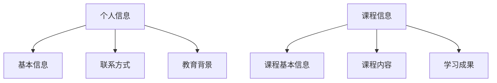

## 1. Architecture Design


## 2. Technology Description
- 前端：React@18 + Tailwind CSS@3 + Vite
- 初始化工具：vite-init
- 后端：无（静态网站）
- 数据库：无（使用本地静态数据）
- 部署平台：Cloudflare Pages

## 3. Route Definitions
| Route | Purpose |
|-------|---------|
| / | 首页，展示个人信息和课程列表 |
| /courses/:id | 课程详情页，展示具体课程信息 |
| /about | 关于页面，展示个人详细信息 |

## 4. API Definitions
- 不适用，本项目为静态网站，无后端API

## 5. Server Architecture Diagram
- 不适用，本项目为静态网站，无服务器架构

## 6. Data Model
### 6.1 Data Model Definition


### 6.2 Data Definition Language
- 不适用，本项目使用静态数据，无数据库

### 6.3 静态数据结构

#### 个人信息数据结构
```typescript
interface PersonalInfo {
  name: string;
  major: string;
  school: string;
  bio: string;
  skills: string[];
  contact: {
    email: string;
    phone: string;
    github?: string;
    linkedin?: string;
  };
  education: {
    school: string;
    major: string;
    startDate: string;
    endDate: string;
  };
}
```

#### 课程数据结构
```typescript
interface Course {
  id: string;
  title: string;
  description: string;
  content?: string;
  outcomes?: string[];
  skills?: string[];
}
```